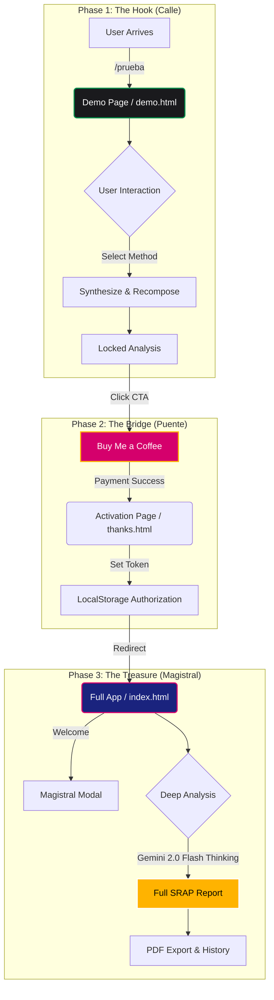

# Oráculo Chalamandra

An AI-powered oracle application providing insights with a distinct "Chalamandra" style.

View your app in AI Studio: https://ai.studio/apps/drive/1j-6WQPKve6ckhFyK_AsB0ikAKw57L8ti

## Conversion Funnel Architecture

This project implements a strategic conversion funnel designed to guide users from a limited demo to a premium, deep-analysis experience.

## Project Structure

The project has been refactored for better organization and maintainability.

- **`src/`**: Contains all source code.
    - **`assets/`**: Centralized static assets.
        - **`styles/`**: CSS files (e.g., `index.css`).
        - **`js/`**: Shared JavaScript/Configuration (e.g., `tailwind-config.js`).
    - **`components/`**: Reusable React components.
    - **`types/`**: TypeScript type definitions.
    - **`utils/`**: Helper functions and constants.
    - **`FullApp.tsx`**: Main application logic.
    - **`DemoApp.tsx`**: Simplified demo version logic.
    - **`main-full.tsx`**: Entry point for the full application.
    - **`main-demo.tsx`**: Entry point for the demo application.

## Entry Points

The application offers two distinct entry points for different user experiences:

- **Full Version**: `index.html` - The complete Oracle experience (Protected).
- **Demo Version**: `demo.html` - A simplified landing page or demo experience.

## Run Locally

**Prerequisites:**  Node.js

1. Install dependencies:
   `npm install`
2. Set the `GEMINI_API_KEY` in [.env.local](.env.local) to your Gemini API key
3. Run the app:
   `npm run dev`

Access the full version at `http://localhost:3000/` and the demo version at `http://localhost:3000/demo.html`.
